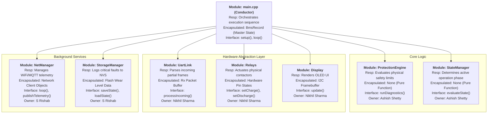

# Architecture

## Hierarchy of Control Diagram

---

## Dependency Constraints

- Allowed dependency directions  
*Strictly Top-Down*  
The Conductor (main.cpp) is the only module allowed to instantiate and call methods from the Core, HAL, and Services layers.
- Forbidden dependencies  
*No Cross-Talk between modules*  
*No Hardware dependencies in Logic/Core Module*  
*No Upward Calls to main.cpp*  
- Global state policy
Global variables are strictly forbidden, with the sole exception of the single BmsRecord master struct instantiated inside main.cpp. Modules are not allowed to maintain hidden, parallel copies of system data.
- Policy on cross-module data sharing  
*Modules do not share data directly.*  
Data is shared via Pass-by-Reference. The Conductor (main.cpp) passes the master BmsRecord into a module (e.g., UartLink::processIncoming(systemRecord)), the module updates or reads it, and control is returned to the Conductor.

---

## Behavioral Mapping

| Module               | Related States                                   | Related Transitions                                              | Related Sequence Diagrams                                                                |   |   |   |
|----------------------|--------------------------------------------------|------------------------------------------------------------------|------------------------------------------------------------------------------------------|---|---|---|
| main.cpp (Conductor) | All States                                       | Drives the continuous loop enabling all transitions              | SD-1, SD-2, SD-3, SD-4, SD-5                                                             |   |   |   |
| ProtectionEngine     | OPERATIONAL, CHARGING, HARD_FAULT, FAULT_HANDLER | OPERATIONAL → HARD_FAULT; CHARGING → FAULT_HANDLER               | SD-3 (Over-Temperature Safety Event), SD-4 (Sensor Communication Failure)                |   |   |   |
| StateManager         | BOOT, IDLE, OPERATIONAL, CHARGING, SAFE_MODE     | BOOT → OPERATIONAL; IDLE ↔ CHARGING; OPERATIONAL → SAFE_MODE     | SD-1 (System Start-Up), SD-2 (Normal Charging Operation), SD-5 (Power Loss and Recovery) |   |   |   |
| UartLink             | OPERATIONAL, CHARGING                            | Triggers timeout transition to HARD_FAULT                        | SD-2 (Periodic Sampling loop), SD-4 (Sensor Communication Failure)                       |   |   |   |
| Relays               | CHARGING, IDLE, HARD_FAULT, SAFE_MODE            | Actuated during IDLE → CHARGING and any active state → FAULT     | SD-1, SD-2, SD-3, SD-4, SD-5 (Contactor actuation in all)                                |   |   |   |
| NetManager           | All active states                                | Active during all normal operations to transmit telemetry/alerts | SD-3 (Send fault alert to ECU), SD-4 (Transmit HARD_FAULT)                               |   |   |   |
| StorageManager       | BOOT, SAFE_MODE, HARD_FAULT                      | BOOT (Read from NVM), SAFE_MODE / FAULT (Write to NVM)           | SD-3 (Log event), SD-5 (Save critical state to NVM)                                      

---

## Interaction Summary

| Module               | Calls                                                                                 | Called By             | Shared Data?                                                                           |
|----------------------|---------------------------------------------------------------------------------------|-----------------------|----------------------------------------------------------------------------------------|
| main.cpp (Conductor) | UartLink, ProtectionEngine, StateManager, Relays, Display, NetManager, StorageManager | None (Top-level loop) | Owns: BmsRecord struct                                                                 |
| ProtectionEngine     | None (Math libraries only)                                                            | main.cpp              | Reads: BmsRecord (Passed by reference)                                                 |
| StateManager         | None                                                                                  | main.cpp              | Reads/Writes: BmsRecord (Passed by reference)                                          |
| UartLink             | None (Serial API only)                                                                | main.cpp              | Writes: BmsRecord (Updates sensor fields via reference)                                |
| Relays               | None (GPIO API only)                                                                  | main.cpp              | None: Receives primitive boolean parameters, completely decoupled from the main struct |
| Display              | None (I2C API only)                                                                   | main.cpp              | Reads: BmsRecord (Passed by const reference to prevent accidental writes)              |
| NetManager           | None (WiFi/MQTT API only)                                                             | main.cpp              | Reads: BmsRecord (Passed by const reference)                                           |
| StorageManager       | None (NVM API only)                                                                   | main.cpp              | Reads/Writes: BmsRecord (Loads saved faults on boot, writes faults on crash)           |

---

## Architectural Rationale

### Organizational Style: Coordinated Conductor Model

The architecture follows a strictly synchronous, coordinated conductor model tailored for deterministic safety:
- A central Conductor (`main.cpp`) owns the master system state and drives the execution loop.
- Functional modules (Core Logic, HAL, Services) do not interact with each other directly; they coordinate entirely through the Conductor via pass-by-reference data sharing.
- Safety logic (`ProtectionEngine`) exists as a stateless, mathematically pure supervisory component that is evaluated first in every cycle.

System control authority resides in: **main.cpp (The Conductor)**  
System state is owned by: **main.cpp (via the single `BmsRecord` struct)**

### Justification

The separation of the ProtectionEngine from normal state management and hardware drivers guarantees that critical safety faults (e.g., Over-Voltage, Over-Temperature) can immediately override system operation without depending on, or waiting for, background tasks like MQTT telemetry or OLED rendering. 

Furthermore, completely decoupling the Core Logic from the Hardware Abstraction Layer (HAL) ensures the safety engine is hardware-agnostic. This enables rigorous Test-Driven Development (TDD), allowing us to simulate millions of extreme battery conditions on a PC.

---

## Task Split

| Member        | Module(s) Owned                 |
|---------------|---------------------------------|
| S Rishab      | NetManager, Storage Manager     |
| Nikhil Sharma | Display, UARTLink, Relays       |
| Ashish Shetty | Protection Engine, StateManager |

---

## Individual Module Specification

---

## Architectural Risk

**Identified Risk:** Synchronous Blocking in the Supervisory Loop

**Why it is a risk:** Our architecture uses a sequential, "bare-metal" supervisory loop in `main.cpp` to execute all tasks deterministically. The risk here is **Thread Starvation via I/O Blocking**. If a Background Service or HAL module experiences a hardware timeout—for example, the `NetManager` hangs for 500ms waiting for an MQTT acknowledgment, or the `Display` locks up due to noise on the I2C bus—the entire loop pauses. During this pause, the `ProtectionEngine` cannot read new UART sensor data. If a short-circuit (Over-Current) occurs exactly during that 500ms network hang, the relays will not open in time, potentially resulting in a catastrophic hardware failure.

**How it might be mitigated later:**
1. **Short-Term Mitigation:** We must strictly enforce non-blocking design patterns in all HAL and Service modules. No `delay()` calls are allowed anywhere in the system; all timeouts must be evaluated against the non-blocking `millis()` timer. We will also implement the `esp_task_wdt` (Hardware Watchdog Timer) to force a chip reset if the loop takes longer than 100ms.
2. **Long-Term Mitigation:** We can migrate the architecture to FreeRTOS (which is natively supported on the ESP32). We would assign the `ProtectionEngine` and `UartLink` to Core 1 as a high-priority task, and relegate `NetManager`, `StorageManager`, and `Display` to lower-priority tasks running on Core 0. This guarantees the safety checks are never preempted by network telemetry.

