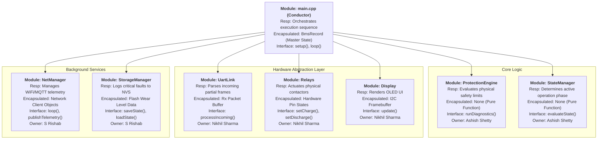

# Architecture

## Hierarchy of Control Diagram

---

## Dependency Constraints

- Allowed dependency directions  
*Strictly Top-Down*  
The Conductor (main.cpp) is the only module allowed to instantiate and call methods from the Core, HAL, and Services layers.
- Forbidden dependencies  
*No Cross-Talk between modules*  
*No Hardware dependencies in Logic/Core Module*  
*No Upward Calls to main.cpp*  
- Global state policy
Global variables are strictly forbidden, with the sole exception of the single BmsRecord master struct instantiated inside main.cpp. Modules are not allowed to maintain hidden, parallel copies of system data.
- Policy on cross-module data sharing  
*Modules do not share data directly.*  
Data is shared via Pass-by-Reference. The Conductor (main.cpp) passes the master BmsRecord into a module (e.g., UartLink::processIncoming(systemRecord)), the module updates or reads it, and control is returned to the Conductor.

---

## Behavioral Mapping

| Module               | Related States                                   | Related Transitions                                              | Related Sequence Diagrams                                                                |   |   |   |
|----------------------|--------------------------------------------------|------------------------------------------------------------------|------------------------------------------------------------------------------------------|---|---|---|
| main.cpp (Conductor) | All States                                       | Drives the continuous loop enabling all transitions              | SD-1, SD-2, SD-3, SD-4, SD-5                                                             |   |   |   |
| ProtectionEngine     | OPERATIONAL, CHARGING, HARD_FAULT, FAULT_HANDLER | OPERATIONAL → HARD_FAULT; CHARGING → FAULT_HANDLER               | SD-3 (Over-Temperature Safety Event), SD-4 (Sensor Communication Failure)                |   |   |   |
| StateManager         | BOOT, IDLE, OPERATIONAL, CHARGING, SAFE_MODE     | BOOT → OPERATIONAL; IDLE ↔ CHARGING; OPERATIONAL → SAFE_MODE     | SD-1 (System Start-Up), SD-2 (Normal Charging Operation), SD-5 (Power Loss and Recovery) |   |   |   |
| UartLink             | OPERATIONAL, CHARGING                            | Triggers timeout transition to HARD_FAULT                        | SD-2 (Periodic Sampling loop), SD-4 (Sensor Communication Failure)                       |   |   |   |
| Relays               | CHARGING, IDLE, HARD_FAULT, SAFE_MODE            | Actuated during IDLE → CHARGING and any active state → FAULT     | SD-1, SD-2, SD-3, SD-4, SD-5 (Contactor actuation in all)                                |   |   |   |
| NetManager           | All active states                                | Active during all normal operations to transmit telemetry/alerts | SD-3 (Send fault alert to ECU), SD-4 (Transmit HARD_FAULT)                               |   |   |   |
| StorageManager       | BOOT, SAFE_MODE, HARD_FAULT                      | BOOT (Read from NVM), SAFE_MODE / FAULT (Write to NVM)           | SD-3 (Log event), SD-5 (Save critical state to NVM)                                      

---

## Interaction Summary

| Module               | Calls                                                                                 | Called By             | Shared Data?                                                                           |
|----------------------|---------------------------------------------------------------------------------------|-----------------------|----------------------------------------------------------------------------------------|
| main.cpp (Conductor) | UartLink, ProtectionEngine, StateManager, Relays, Display, NetManager, StorageManager | None (Top-level loop) | Owns: BmsRecord struct                                                                 |
| ProtectionEngine     | None (Math libraries only)                                                            | main.cpp              | Reads: BmsRecord (Passed by reference)                                                 |
| StateManager         | None                                                                                  | main.cpp              | Reads/Writes: BmsRecord (Passed by reference)                                          |
| UartLink             | None (Serial API only)                                                                | main.cpp              | Writes: BmsRecord (Updates sensor fields via reference)                                |
| Relays               | None (GPIO API only)                                                                  | main.cpp              | None: Receives primitive boolean parameters, completely decoupled from the main struct |
| Display              | None (I2C API only)                                                                   | main.cpp              | Reads: BmsRecord (Passed by const reference to prevent accidental writes)              |
| NetManager           | None (WiFi/MQTT API only)                                                             | main.cpp              | Reads: BmsRecord (Passed by const reference)                                           |
| StorageManager       | None (NVM API only)                                                                   | main.cpp              | Reads/Writes: BmsRecord (Loads saved faults on boot, writes faults on crash)           |

---

## Architectural Rationale

### Organizational Style: Coordinated Conductor Model

The architecture follows a strictly synchronous, coordinated conductor model tailored for deterministic safety:
- A central Conductor (`main.cpp`) owns the master system state and drives the execution loop.
- Functional modules (Core Logic, HAL, Services) do not interact with each other directly; they coordinate entirely through the Conductor via pass-by-reference data sharing.
- Safety logic (`ProtectionEngine`) exists as a stateless, mathematically pure supervisory component that is evaluated first in every cycle.

System control authority resides in: **main.cpp (The Conductor)**  
System state is owned by: **main.cpp (via the single `BmsRecord` struct)**

### Justification

The separation of the ProtectionEngine from normal state management and hardware drivers guarantees that critical safety faults (e.g., Over-Voltage, Over-Temperature) can immediately override system operation without depending on, or waiting for, background tasks like MQTT telemetry or OLED rendering. 

Furthermore, completely decoupling the Core Logic from the Hardware Abstraction Layer (HAL) ensures the safety engine is hardware-agnostic. This enables rigorous Test-Driven Development (TDD), allowing us to simulate millions of extreme battery conditions on a PC.

---

## Task Split

| Member        | Module(s) Owned                 |
|---------------|---------------------------------|
| S Rishab      | NetManager, Storage Manager     |
| Nikhil Sharma | Display, UARTLink, Relays       |
| Ashish Shetty | Protection Engine, StateManager |

---

## Individual Module Specification

## Module: NetManager

### Purpose and Responsibilities
- Manages the WiFi connection state asynchronously without blocking the main loop.
- Synchronizes the system clock with an NTP server to provide accurate timestamps.
- Packages the `BmsRecord` data into JSON format and publishes it to the cloud via MQTT for remote telemetry.

### Inputs
- **Events received:** `loop()` called continuously by the Conductor; `publishTelemetry()` called on a timer.
- **Data received:** `BmsRecord` master state (passed by constant reference).
- **Assumptions about inputs:** The WiFi and MQTT credentials provided in `Secrets.h` are correct and the network is in range.

### Outputs
- **Events emitted:** Publishes JSON formatted string payload to the defined MQTT topic.
- **Commands issued:** None (Service module; does not control hardware).
- **Guarantees provided:** Network operations (reconnecting, publishing) will timeout gracefully and will **never** block the main supervisory loop from executing its safety checks.

### Internal State (Encapsulation)
- **State variables:** `WiFiClient` object, `PubSubClient` object, connection status booleans.
- **Configuration parameters:** SSID, Password, MQTT Broker IP, MQTT Port, NTP Server URL.
- **Internal invariants:** Telemetry is only formatted and published if both WiFi and MQTT are currently flagged as connected.

### Initialization / Deinitialization
- **Init requirements:** 1. The hardware WiFi antenna must be powered and initialized by the ESP32 core.
  2. The system must wait a maximum of 3000ms for an initial connection before yielding control back to the Conductor.
- **Shutdown behavior:** Gracefully disconnects the MQTT client and drops the WiFi connection to prevent socket hangs on the broker.
- **Reset behavior:** Automatically attempts to reconnect incrementally if the connection drops during runtime.

### Basic Protection Rules (Light Safeguards)
- **What inputs are validated:** Checks the return status of `WiFi.status()` and `mqttClient.connected()` before attempting any network transmission.
- **What invalid conditions are rejected:** Rejects requests to publish if the network layer is down (drops the packet rather than blocking).
- **What invariants are enforced:** Strict non-blocking timeouts on all network calls.
- **Where are errors escalated:** Errors are logged to the Serial monitor for debugging but do not trigger a BMS physical fault (a network drop is not a physical safety hazard).

### Module-Level Tests

| Test ID | Purpose | Stimulus | Expected Outcome |
|--------|---------|----------|------------------|
| NET-01 | Non-blocking connect | Supply invalid WiFi password | Module yields within 3s, system continues running |
| NET-02 | Telemetry packaging | Supply `BmsRecord` with 4.2V | Generates valid JSON string `{"v1":4.20}` |
| NET-03 | MQTT disconnect recovery | Drop physical router connection | Module sets `connected = false`, stops publishing cleanly |

---

## Module: StorageManager

### Purpose and Responsibilities
- Acts as a "Black Box" flight recorder for the BMS.
- Saves critical system state (e.g., `FAULT_HARD` flags, State of Charge percentage) to Non-Volatile Storage (NVS) flash memory so it persists across hardware reboots.
- Loads the saved state upon boot to prevent the system from re-closing the relays if it crashed due to a critical safety event.

### Inputs
- **Events received:** `saveState()` called by Conductor on state change; `loadState()` called on system boot.
- **Data received:** Relevant subset of `BmsRecord` (Current State, Fault Flags).
- **Assumptions about inputs:** Assumes the flash memory is not physically corrupted and has available sector space.

### Outputs
- **Events emitted:** Restores previously saved `BmsRecord` fields into memory on boot.
- **Commands issued:** None.
- **Guarantees provided:** A critical `FAULT_HARD` written to memory will survive a complete power loss and prevent accidental relay closure on the next boot.

### Internal State (Encapsulation)
- **State variables:** Cached copy of the last written fault state (to prevent redundant writes).
- **Configuration parameters:** NVS Namespace identifier (e.g., `"bms_data"`), Storage Keys.
- **Internal invariants:** Only initiates a flash write cycle if the new data differs from the cached data.

### Initialization / Deinitialization
- **Init requirements:** 1. The NVS partition must be successfully mounted via the `Preferences` API.
  2. The module must verify the data integrity of the existing save file (checking for null or corrupted reads).
- **Shutdown behavior:** Calls `end()` on the NVS preferences to cleanly close the flash memory handle.
- **Reset behavior:** Can explicitly format/clear the NVS partition if the user holds the physical hardware reset button for >5 seconds.

### Basic Protection Rules (Light Safeguards)
- **What inputs are validated:** Checks if the NVS `begin()` function returns true before attempting any reads/writes.
- **What invalid conditions are rejected:** Rejects redundant write requests to protect the flash memory from "wear-out" (Flash memory degrades after ~100,000 writes).
- **What invariants are enforced:** Data bounds checking (e.g., reading a stored fault code of `0xFF` which doesn't exist in our enum defaults to a safe lockdown).
- **Where are errors escalated:** If flash memory fails to mount or is corrupted, it alerts the Conductor to default to `STATE_FAULT_HARD` as a fail-safe.

### Module-Level Tests

| Test ID | Purpose | Stimulus | Expected Outcome |
|--------|---------|----------|------------------|
| STO-01 | Fault persistence | Call `saveState(FAULT_OVP)`, reboot | `loadState()` returns `FAULT_OVP` |
| STO-02 | Flash wear protection | Call `saveState(IDLE)` 100 times | NVS physical write function is only triggered once |
| STO-03 | Corrupted read handling | Corrupt NVS sector, call `loadState()` | Returns safe default (`FAULT_HARD`), does not crash |

## Module: StateManager

### Purpose and Responsibilities
- Determines the active operational phase of the battery (e.g., STATE_IDLE, STATE_CHARGING, STATE_PRE_CHARGE).
- Applies mathematical hysteresis to prevent relay chattering (e.g., not re-entering charge mode until voltage drops significantly).
- Enforces safe transition paths (e.g., preventing a jump from IDLE directly to DISCHARGING without passing through PRE_CHARGE).

### Inputs
- **Events received:** evaluateState() called synchronously by the Conductor every loop.
- **Data received:** BmsRecord (specifically reads the FaultFlags, raw voltages, and current draw).
- **Assumptions about inputs:** Assumes that the ProtectionEngine has already run in the current loop cycle and the FaultFlags are fully up-to-date.

### Outputs
- **Events emitted:** None (pure logic).
- **Commands issued:** Updates the BmsState currentState enum inside the BmsRecord.
- **Guarantees provided:** Will immediately force the state to STATE_FAULT_HARD if any critical fault flag is detected, overriding all other logic.

### Internal State (Encapsulation)
- **State variables:** None. It is a pure logic engine. It relies entirely on the state history stored inside the BmsRecord.
- **Configuration parameters:** Hysteresis thresholds defined in Config.h (e.g., FULL_VOLTAGE = 4.20V, RECHARGE_VOLTAGE = 4.05V).
- **Internal invariants:** A Fault state can only be cleared by a manual reset flag, never automatically.

### Initialization / Deinitialization
- **Init requirements:** 1. Must be provided a valid memory reference to the master BmsRecord structure to operate.
  2. Must explicitly set the initial state to STATE_BOOT upon the first execution cycle.
- **Shutdown behavior:** Defaults the target state to STATE_DEEP_SLEEP if low voltage is sustained.
- **Reset behavior:** Evaluates the environment from scratch to safely transition from BOOT to IDLE or FAULT.

### Basic Protection Rules (Light Safeguards)
- **What inputs are validated:** Validates the transition matrix (e.g., is the requested state change legally allowed?).
- **What invalid conditions are rejected:** Rejects transitioning to STATE_CHARGING if the FaultFlags bitmask is non-zero.
- **What invariants are enforced:** Hysteresis bounds (0.15V gap between full and recharge).
- **Where are errors escalated:** Invalid state requests are ignored, and the system defaults to the safest known state (Idle/Open).

### Module-Level Tests

| Test ID | Purpose | Stimulus | Expected Outcome |
|--------|---------|----------|------------------|
| SM-01  | Hysteresis check | Input 4.15V while in FULL_IDLE | State remains FULL_IDLE (requires < 4.05V) |
| SM-02  | Fault override | Set OVP fault flag while CHARGING | State immediately transitions to FAULT_HARD |
| SM-03  | Pre-charge path | Request load while in IDLE | State transitions to PRE_CHARGE, not DISCHARGING |

---

## Module: ProtectionEngine

### Purpose and Responsibilities
- Validates all incoming sensor telemetry against the physical and chemical safety limits of the lithium-ion cells.
- Acts as the primary safety gatekeeper, determining if a condition requires a warning (FAULT_SOFT) or an immediate physical lockdown (FAULT_HARD).

### Inputs
- **Events received:** runDiagnostics() called synchronously by the Conductor every loop.
- **Data received:** BmsRecord (Cell voltages, currents, dual temperatures, timestamps).
- **Assumptions about inputs:** Sensor data may be stale, partial, or corrupted by electrical noise.

### Outputs
- **Events emitted:** None (pure logic).
- **Commands issued:** Calculates and writes a binary FaultFlags bitmask into the BmsRecord.
- **Guarantees provided:** Will flag an absolute lockdown if any physical limit is breached or if sensor data is too old.

### Internal State (Encapsulation)
- **State variables:** None (Stateless pure function).
- **Configuration parameters:** Hardware limits defined in Config.h (e.g., 4.25V OVP, 60°C OTP, 3000ms Data Timeout).
- **Internal invariants:** Evaluation priority strictly evaluates Over-Voltage and Over-Temperature before under-voltage.

### Initialization / Deinitialization
- **Init requirements:** 1. Must verify that the configuration limit definitions in Config.h compile within physically possible ranges (e.g., OVP < 5.0V).
  2. Must clear all legacy fault bitmasks to 0x00 in memory before beginning the first diagnostic pass.
- **Shutdown behavior:** Safely outputs a full fault bitmask 0xFF if calculation fails.
- **Reset behavior:** Recalculates all limits instantaneously; relies on StateManager to handle the actual recovery path.

### Basic Protection Rules (Light Safeguards)
- **What inputs are validated:** Timestamps of all incoming float values to ensure freshness.
- **What invalid conditions are rejected:** Data older than 3000ms is rejected, triggering a FAULT_STALE_DATA flag.
- **What invariants are enforced:** Delta Temperature ($\Delta T$) between charge and discharge sensors cannot exceed 15 degrees Celsius.
- **Where are errors escalated:** The calculated bitmask is passed back to the Conductor, which orchestrates the physical relay disconnect.

### Module-Level Tests

| Test ID | Purpose | Stimulus | Expected Outcome |
|--------|---------|----------|------------------|
| PROT-01| Over-voltage trigger | Inject v1 = 4.30V | Returns bitmask 0x01 (OVP) |
| PROT-02| Stale data watchdog | Inject timestamp $t - 5000ms$ | Returns bitmask 0x20 (Timeout) |
| PROT-03| Delta Temp validation | Inject $T_{chg}=40, T_{dis}=20$ | Returns bitmask 0x10 (Delta-T Error) |

---

## Architectural Risk

**Identified Risk:** Synchronous Blocking in the Supervisory Loop

**Why it is a risk:** Our architecture uses a sequential, "bare-metal" supervisory loop in `main.cpp` to execute all tasks deterministically. The risk here is **Thread Starvation via I/O Blocking**. If a Background Service or HAL module experiences a hardware timeout—for example, the `NetManager` hangs for 500ms waiting for an MQTT acknowledgment, or the `Display` locks up due to noise on the I2C bus—the entire loop pauses. During this pause, the `ProtectionEngine` cannot read new UART sensor data. If a short-circuit (Over-Current) occurs exactly during that 500ms network hang, the relays will not open in time, potentially resulting in a catastrophic hardware failure.

**How it might be mitigated later:**
1. **Short-Term Mitigation:** We must strictly enforce non-blocking design patterns in all HAL and Service modules. No `delay()` calls are allowed anywhere in the system; all timeouts must be evaluated against the non-blocking `millis()` timer. We will also implement the `esp_task_wdt` (Hardware Watchdog Timer) to force a chip reset if the loop takes longer than 100ms.
2. **Long-Term Mitigation:** We can migrate the architecture to FreeRTOS (which is natively supported on the ESP32). We would assign the `ProtectionEngine` and `UartLink` to Core 1 as a high-priority task, and relegate `NetManager`, `StorageManager`, and `Display` to lower-priority tasks running on Core 0. This guarantees the safety checks are never preempted by network telemetry.

