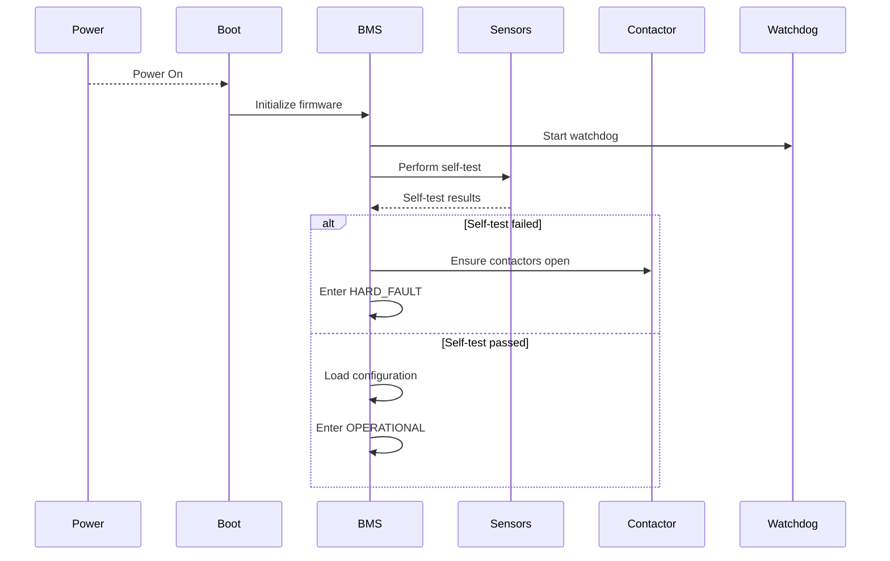
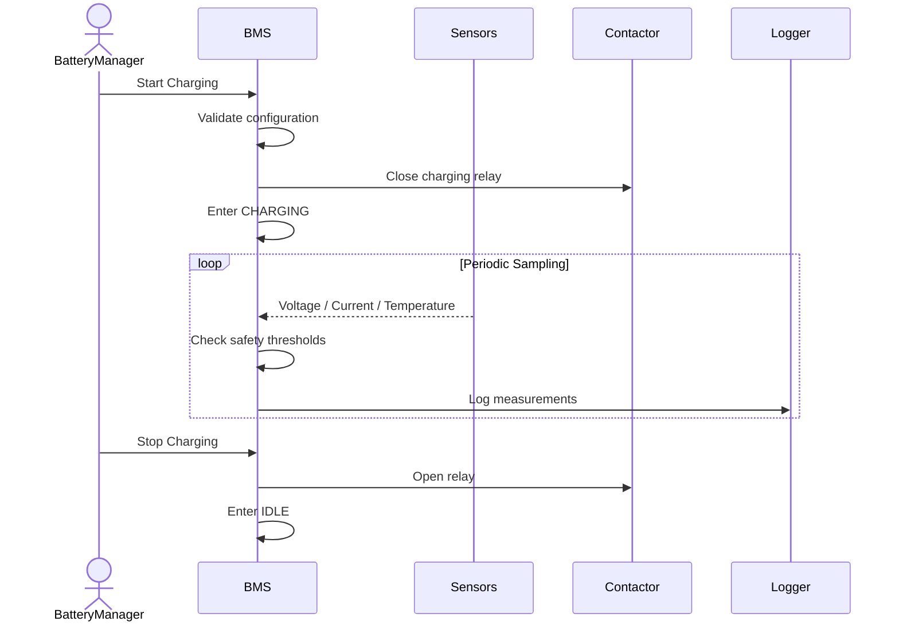
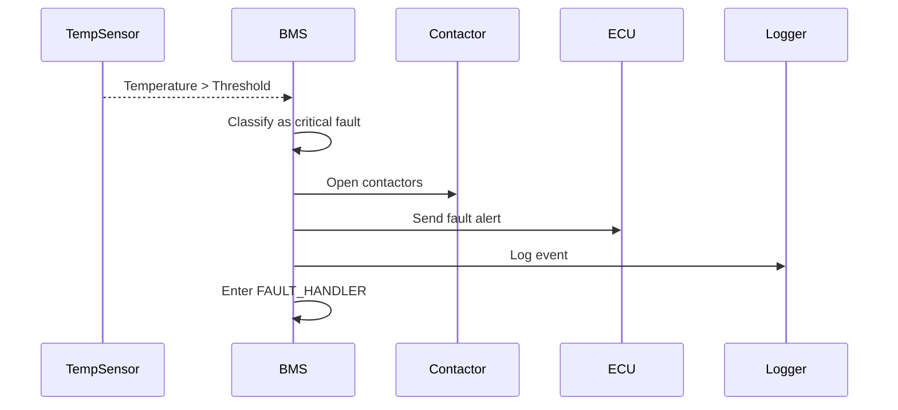
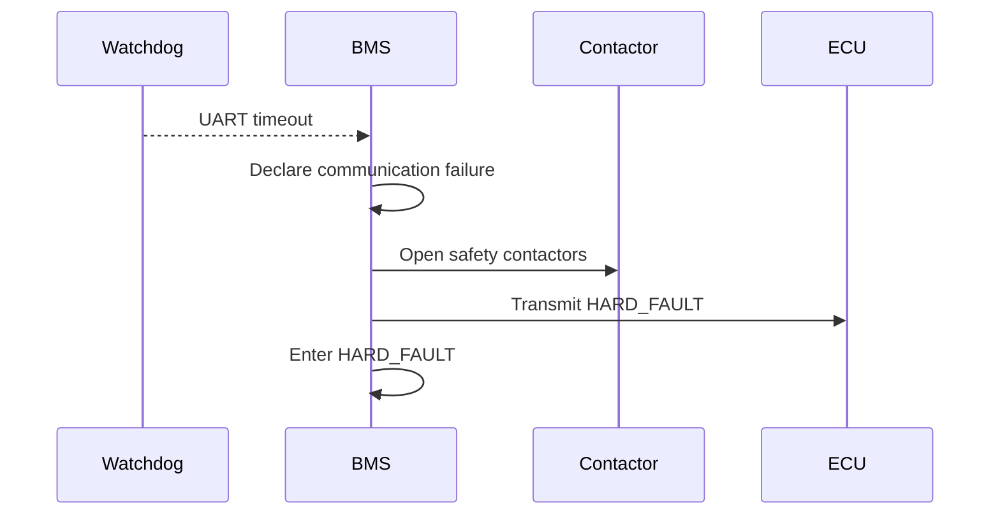
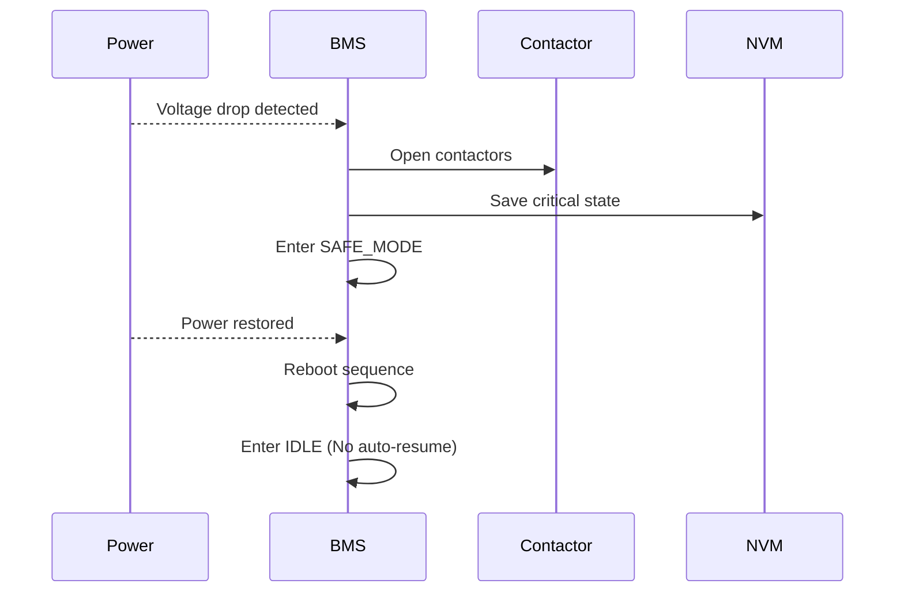

# SDLC Traceability – Battery Management System (BMS)

> **Project:** Battery Management System (BMS)  
> **Team:** Group-9

---

## 1. Key Sequence Diagrams

### SD-1: System Start-Up and Initialization

---

### SD-2: Normal Charging Operation (Sunny Day)

---

### SD-3: Over-Temperature Safety Event

---

### SD-4: Sensor Communication Failure

---

---

### SD-5: Power Loss and Recovery

---

---

## 2. Traceability Matrix

| Requirement                      | Statechart Element(s) | Sequence Diagram(s) | Test ID |
| -------------------------------- | --------------------- | ------------------- | ------- |
| R-F1 Monitor parameters          | OPERATIONAL           | SD-2                | T-1     |
| R-F2 Start/Stop charging         | IDLE, CHARGING        | SD-2                | T-2     |
| R-S1 Over-temperature protection | FAULT_HANDLER         | SD-3                | T-3     |
| R-S2 Sensor failure detection    | HARD_FAULT            | SD-4                | T-4     |
| R-S3 Open contactor on fault     | SAFE_MODE             | SD-3, SD-4          | T-5     |
| R-P1 Safe power loss handling    | SAFE_MODE             | SD-5                | T-6     |
| R-P2 No auto-resume after reset  | IDLE                  | SD-5                | T-7     |

---

## 3. Test Plan

The tests are design-level and validate requirement realization.

---

### T-1: Continuous Monitoring

**Related Requirements**

- R-F1

**Purpose**
Verify continuous monitoring of battery parameters.

**Preconditions**

- System in OPERATIONAL state
- Sensors connected

**Stimulus**

- Apply nominal operating values

**Expected Outcome**

- System remains in OPERATIONAL state
- No fault triggered

**Pass Criteria**

- Periodic sampling observed
- No unintended transitions

---

### T-2: Start and Stop Charging

**Related Requirements**

- R-F2

**Purpose**
Verify correct charging state transitions.

**Preconditions**

- System in IDLE

**Stimulus**

- Issue Start Charging command
- Issue Stop Charging command

**Expected Outcome**

- IDLE → CHARGING → IDLE
- Correct relay control

**Pass Criteria**

- Charging starts/stops only via command

---

### T-3: Over-Temperature Fault Handling

**Related Requirements**

- R-S1

**Purpose**
Verify immediate safety action during thermal fault.

**Preconditions**

- System in CHARGING state

**Stimulus**

- Inject temperature above threshold

**Expected Outcome**

- Contactor opens
- System enters FAULT_HANDLER

**Pass Criteria**

- Charging stops immediately
- Fault logged

---

### T-4: Sensor Communication Failure

**Related Requirements**

- R-S2

**Purpose**
Verify watchdog-based communication monitoring.

**Preconditions**

- System in OPERATIONAL

**Stimulus**

- Stop UART data stream

**Expected Outcome**

- HARD_FAULT state entered
- Contactors open

**Pass Criteria**

- Fault declared within timeout window

---

### T-5: Contactor Safety Enforcement

**Related Requirements**

- R-S3

**Purpose**
Ensure contactors open during critical fault.

**Preconditions**

- System operational

**Stimulus**

- Inject critical fault

**Expected Outcome**

- Contactors open immediately

**Pass Criteria**

- No energy transfer under fault

---

### T-6: Power Loss Handling

**Related Requirements**

- R-P1

**Purpose**
Verify safe behavior on unexpected power loss.

**Preconditions**

- System in CHARGING state

**Stimulus**

- Remove power

**Expected Outcome**

- Contactors open
- SAFE_MODE entered

**Pass Criteria**

- No unsafe restart

---

### T-7: No Auto Resume After Reset

**Related Requirements**

- R-P2

**Purpose**
Ensure charging does not restart automatically.

**Preconditions**

- Previous hard fault occurred

**Stimulus**

- Reboot system

**Expected Outcome**

- System enters IDLE

**Pass Criteria**

- Charging does not resume without command

---

## 4. Gap and Risk Analysis

- Multiple simultaneous faults require prioritization logic.
- Watchdog timeout calibration must avoid false positives.
- Sensor accuracy directly impacts safety behavior.
- Power-loss handling depends on reliable non-volatile memory storage.

---
