## System Boundary

### Inside the System
-  Battery Charging and Discharging State
-  Voltage and Temperature Reading
-  Monitoring battery voltage, current, and temperature
-  Fault detection
-  State Management and Transition
-  Cloud Logging
-  Generating safety alerts and status signals

### Outside the System
-  Temperature Sensor
-  Battery pack and current discharge
-  Battery Chemistry
-  External Power and Network connection
-  Ambient environment
-  Temperature and Voltage Sensor
-  External Power Source

### Assumptions
-  Sensors provides periodic update
-  Availibility of the Network for the cloud logging
-  Battery voltage is stable for the computation
-  User responds to safety alerts and status signals

---

## System Context

### Actors and Interfaces

| Actor / Entity | Type | Interface Description |
|---------------|------|-----------------------|
|Battery Manager | User | Configuration, alerts and status acknowledgement |
|Voltage Sensor | Sensor | Voltage Measurement data |
|Sensor | Sensor | Current Measurement data  |
|Temperature Sensor | Sensor | Temperature Measurement data |
|Power Supply | System | Power presence / loss signal|
|Charging/Discharging Circuit | Actuator | Charging and Discharging Control |

---

## Selected Use Cases

| ID   | Use Case          | Actor            | Description                                      |
| ---- | ----------------- | ---------------- | ------------------------------------------------ |
| UC-1        | Start Charging|Battery Manager|Configure and set the battery pack to charge|
| UC-2        |Handle Temperature|Temperature Sensor|Measure temperature of the battery pack and operate under safety limits|
| UC-3        |Handle Voltage|Voltage Sensor|Measure voltage across battery and ensure safe power delivery|
| UC-4        |Handle Current|Current Sensor|Measure current across battery and ensure safe power delivery|
| UC-5        |Handle Power Loss|Power Supply|Transition to safe state on power failure|
| UC-6        |Stop Charging|Battery Manager|Turn off charging to a battery pack manually|
| UC-7        |Cloud Logging |Battery Manager|Show the battery logs and faults on a remote server|
| UC-8        |Detect Sensor Failure |Battery Manager/Watchdog|Detect if UART data stream stops (communication loss) and trigger emergency stop.|
---

### Use Case Descriptions

#### UC-1: Start Charging
- Goal: Safely initiate the charging process for the battery pack.
- Trigger: Charger connection detected (Current > 0).
- Main Interaction: Validate system status → close charging relays → begin CC/CV monitoring.
- Outcome: System enters Charging state.

#### UC-2: Handle Temperature
- Goal: Monitor thermal conditions to prevent overheating or freezing.
- Trigger: UART packet received containing temperature data.
- Main Interaction: Parse temperature → check against safety limits.
- Outcome: System continues operation OR transitions to Overtemperature Fault.

#### UC-3: Handle Voltage
- Goal: Monitor individual cell and total pack voltages to prevent damage.
- Trigger: UART packet received containing voltage data.
- Main Interaction: Calculate cell imbalance → check Under-Voltage/Over-Voltage thresholds.
- Outcome: System updates SoC stats OR transitions to Voltage Fault.

#### UC-4: Handle Current
- Goal: Monitor current flow for overload protection and capacity tracking.
- Trigger: UART packet received containing current data.
- Main Interaction: Parse current → check against Max Discharge/Charge ratings → integrate for Coulomb Counting.
- Outcome: System updates SoC stats OR transitions to Over-Current Fault.

#### UC-5: Handle Power Loss
- Goal: Ensure system fails safely if the ESP32 itself loses power.
- Trigger: Supply voltage drops below critical threshold (Brownout).
- Main Interaction: Detect power drop → write critical state to non-volatile memory (NVS) → open safety contactors.
- Outcome: System enters Safe state with data preserved.

#### UC-6: Stop Charging
- Goal: Safely terminate the charging process.
- Trigger: Battery reaches 100% SoC.
- Main Interaction: Open charging relays → log session energy → reset charging flags.
- Outcome: System transitions to Idle state.

#### UC-7: Cloud Logging
- Goal: Enable remote monitoring and historical fault analysis.
- Trigger: Periodic timer expires OR Fault event occurs.
- Main Interaction: Gather sensor values → format JSON payload → publish to MQTT/HTTP endpoint.
- Outcome: Live data is visible on the remote dashboard.

#### UC-8: Detect Sensor Failure
- Goal: Ensure fail-safe operation if the external measurement module disconnects.
- Trigger: Watchdog Timer expires (No UART data > 2 seconds).
- Main Interaction: Increment failure counter → declare communication loss → force open safety contactors.
- Outcome: System enters Hard Fault (Safe Mode) requiring manual reset.
---

## UML Statechart (Behavioral Model)

```mermaid
stateDiagram-v2
    [*] --> POWER_ON
    
    POWER_ON --> INITIALIZATION: System Boot
    
    %% ==========================================
    %% SUPER STATE: INITIALIZATION
    %% Focus: Self-Check & Establishing Comms
    %% ==========================================
    state INITIALIZATION {
        [*] --> SELF_TEST
        
        SELF_TEST --> CONFIG_LOAD: HW Checks OK
        CONFIG_LOAD --> UART_SYNC: Config Loaded
        UART_SYNC --> CHECK_SENSORS: Header/Checksum Found
        CHECK_SENSORS --> VALIDATION_COMPLETE: Readings Plausible

        %% Failure paths within Init
        SELF_TEST --> INIT_FAIL: HW Error
        UART_SYNC --> INIT_FAIL: Timeout (>2s)
        CHECK_SENSORS --> INIT_FAIL: Sensors Mismatch
    }
    
    state init_check <<choice>>
    INITIALIZATION --> init_check
    init_check --> OPERATIONAL: If Init Success
    init_check --> FAULT_HANDLER: If Init Fail



    %% ==========================================
    %% SUPER STATE: OPERATIONAL
    %% Focus: Routine Battery Management
    %% ==========================================
    state OPERATIONAL {
        [*] --> PRE_CHARGE
        
        %% Sub-state: Pre-Charge Logic
        PRE_CHARGE --> STANDBY_IDLE: Bus Voltage Stabilized
        
        %% Sub-state: IDLE
        state STANDBY_IDLE {
            [*] --> MONITORING
            MONITORING --> DEEP_SLEEP: Inactivity (>1hr)
            DEEP_SLEEP --> MONITORING: Wakeup Trigger
        }

        %% Sub-state: CHARGING (Composite)
        state CHARGING {
            [*] --> CC_MODE
            CC_MODE --> CV_MODE: Voltage > Target
            CV_MODE --> BALANCING: Current Tapering
            BALANCING --> CHARGE_COMPLETE: Cells Balanced
            
            
        }

        %% Sub-state: DISCHARGING
        state DISCHARGING {
             [*] --> DISCHARGE_ACTIVE
             DISCHARGE_ACTIVE --> LOW_POWER_WARNING: SoC < 20%
             LOW_POWER_WARNING --> DISCHARGE_ACTIVE: Load Reduced
        }

        %% Operational Transitions
        STANDBY_IDLE --> CHARGING: Current > 100mA
        CHARGING --> STANDBY_IDLE: Current ~ 0mA
        
        STANDBY_IDLE --> DISCHARGING: Current < -100mA
        DISCHARGING --> STANDBY_IDLE: Current ~ 0mA
    }


    %% ==========================================
    %% SUPER STATE: FAULT HANDLING
    %% Focus: Safety & Conservation
    %% ==========================================
    state FAULT_HANDLER {
        [*] --> CLASSIFY_FAULT
        
        state fault_fork <<choice>>
        CLASSIFY_FAULT --> fault_fork
        
        %% Path 1: Soft Fault (Recoverable)
        fault_fork --> SOFT_FAULT: Warning / Timeout
        SOFT_FAULT --> COOLDOWN: Wait for Recovery
        COOLDOWN --> RECOVERY_CHECK: Sensors Normal?
        
        %% Path 2: Hard Fault (Critical)
        fault_fork --> HARD_LOCKOUT: Critical Limits
        HARD_LOCKOUT --> SOS_SIGNAL: Latch State
    }

    %% ==========================================
    %% GLOBAL TRANSITIONS (Safety Net)
    %% ==========================================
    OPERATIONAL --> FAULT_HANDLER: **Safety Trigger**
    
    %% Recovery Transitions
    RECOVERY_CHECK --> OPERATIONAL: Auto-Reset Allowed
    RECOVERY_CHECK --> SOFT_FAULT: Conditions Persist
    SOS_SIGNAL --> INITIALIZATION: **Manual Hard Reset ONLY**
```

---
## Safety and Error Handling (Behavioral View)
- Fault events (Voltage, Current, Temp) immediately override normal operation.
- Charge/Discharge relays are always opened *before* faults are logged or transmitted.
- Communication loss (UART Watchdog) forces a transition to Hard Fault after timeout.
- Power loss forces a transition to Safe Shutdown from any state (saving data to NVS).
- Recovery from Hard Faults requires explicit user intervention (Manual Reset).

## Change Log
| Date | Change          | Author  |
| ---- | --------------- | ------- |
|      | Initial version |Given  |
|1 Feburary 2026|Add State Chart|Group-9|